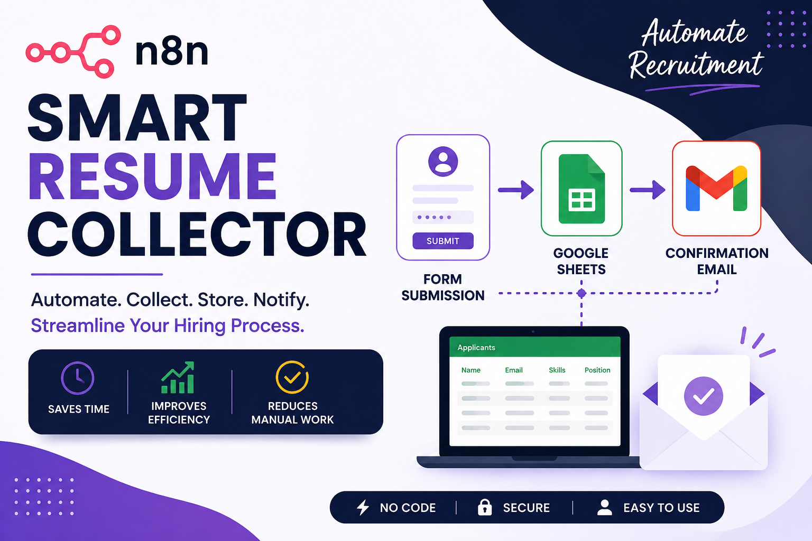
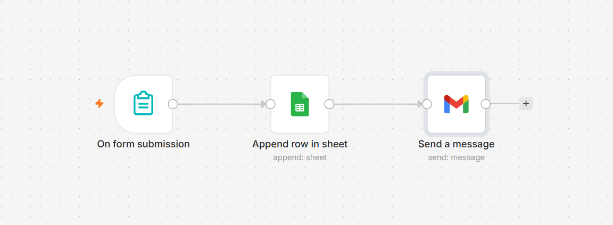
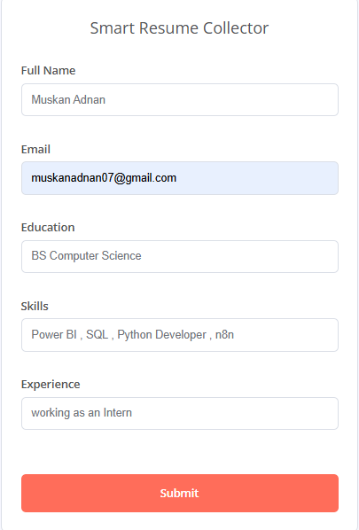
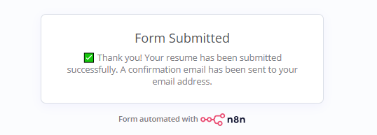
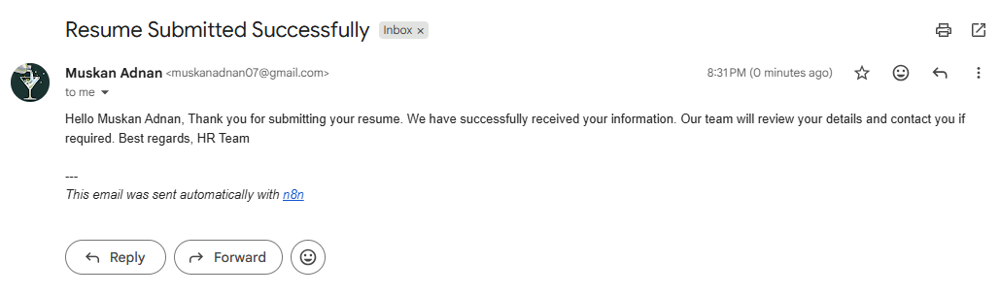

# 🤖 Smart Resume Collector using n8n



## 📌 Overview

Smart Resume Collector is an automation workflow built using **n8n** that simplifies the resume submission process. Applicants fill out an online form, their information is automatically stored in Google Sheets, and a confirmation email is sent instantly using Gmail.

---

## 🎯 Problem Statement

Collecting applicant information manually can be repetitive and time-consuming. This project automates the entire submission process, ensuring that applicant details are securely stored while providing immediate confirmation via email.

---

## ✨ Features

- 📄 Online resume submission form
- 📊 Automatically stores applicant details in Google Sheets
- 📧 Sends instant confirmation emails
- ⚡ Fully automated using n8n
- 🛠️ Easy to customize for different recruitment workflows

---

## 🛠️ Technologies Used

- n8n
- Google Forms (n8n Form)
- Google Sheets
- Gmail
- JSON Workflow

---

## 🔄 Workflow



### Workflow Steps

1. Applicant fills out the resume submission form.
2. The workflow captures all submitted information.
3. Applicant details are stored automatically in Google Sheets.
4. Gmail sends a confirmation email to the applicant.

---

## 📷 Screenshots

### 📝 Resume Submission Form



---

### ✅ Successful Submission



---

### 📧 Confirmation Email



---

## 🎥 Demo

Watch the complete workflow demonstration by opening:

📁 `Demo/demo.mp4`
---

## 📂 Repository Structure

```text
smart-resume-collector/
│
├── Workflow/
├── Images/
├── Demo/
└── README.md
```

---

## 🚀 Future Improvements

- AI-powered resume screening
- Resume scoring
- Recruiter dashboard
- Applicant tracking system
- Automatic recruiter notifications

---

## 👩‍💻 Author

**Muskan Adnan**

Aspiring Data Analyst | Python | SQL | Power BI | n8ns